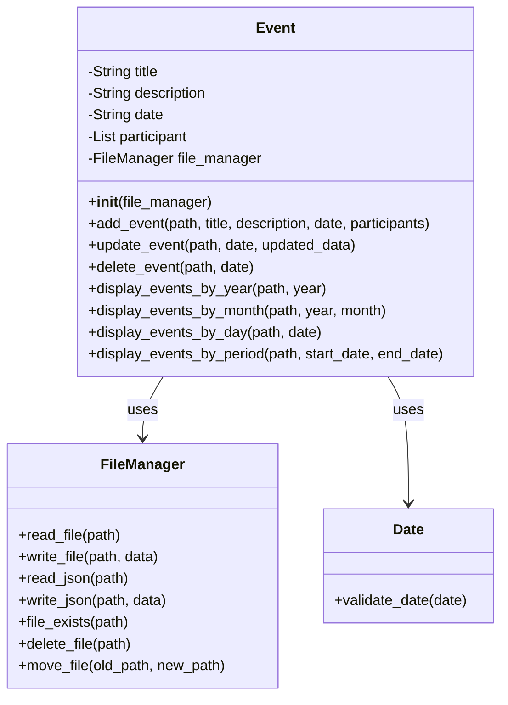

```mermaid
classDiagram
    class Event {
        -String title
        -String description
        -String date
        -List participant
        -FileManager file_manager
        +__init__(file_manager)
        +add_event(path, title, description, date, participants)
        +update_event(path, date, updated_data)
        +delete_event(path, date)
        +display_events_by_year(path, year)
        +display_events_by_month(path, year, month)
        +display_events_by_day(path, date)
        +display_events_by_period(path, start_date, end_date)
    }

    class FileManager {
        +read_file(path)
        +write_file(path, data)
        +read_json(path)
        +write_json(path, data)
        +file_exists(path)
        +delete_file(path)
        +move_file(old_path, new_path)
    }

    class Date {
        +validate_date(date)
    }

    Event --> FileManager : uses
    Event --> Date : uses

```