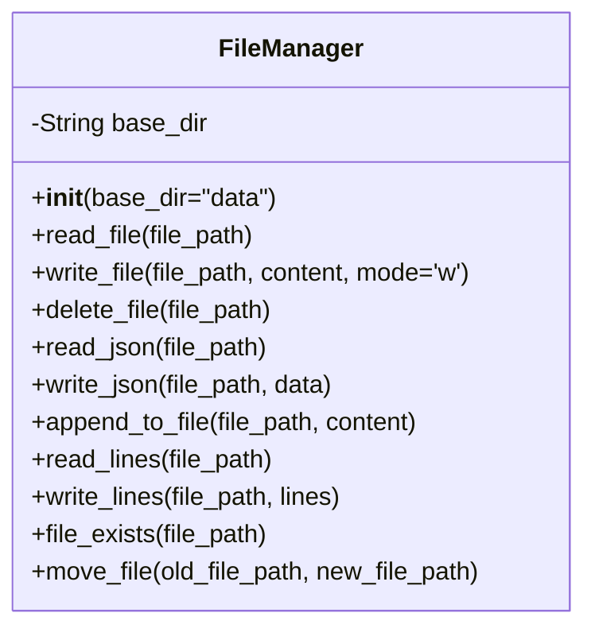

```mermaid
classDiagram
    class FileManager {
        -String base_dir
        +__init__(base_dir="data")
        +read_file(file_path)
        +write_file(file_path, content, mode='w')
        +delete_file(file_path)
        +read_json(file_path)
        +write_json(file_path, data)
        +append_to_file(file_path, content)
        +read_lines(file_path)
        +write_lines(file_path, lines)
        +file_exists(file_path)
        +move_file(old_file_path, new_file_path)
    }

```