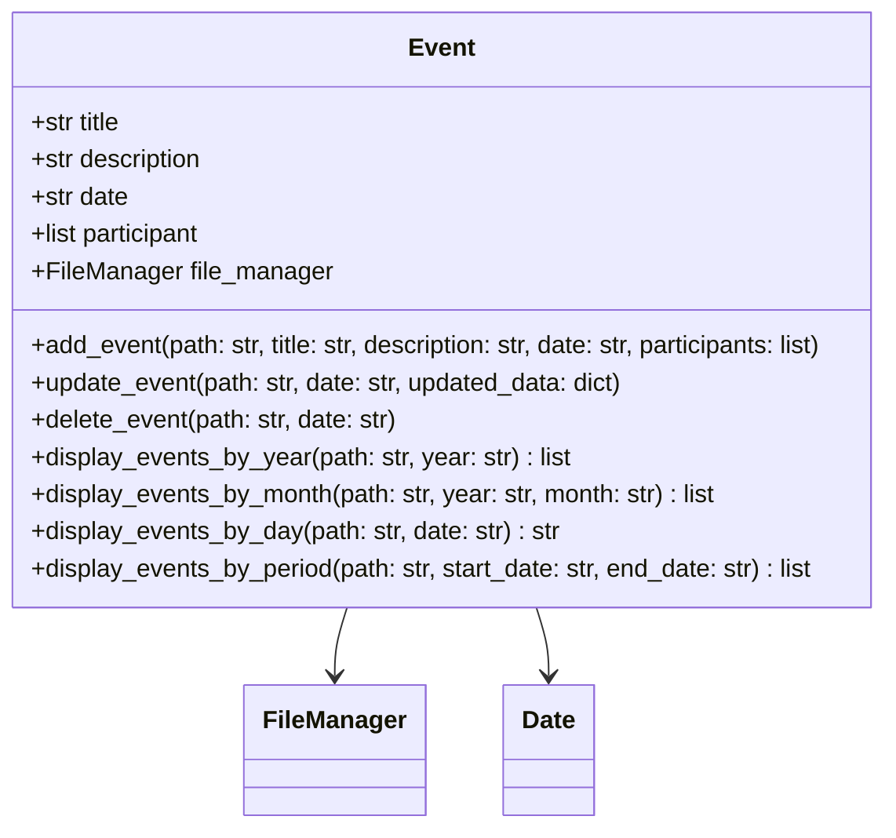

```mermaid
classDiagram
    class Event {
        +str title
        +str description
        +str date
        +list participant
        +FileManager file_manager
        +add_event(path: str, title: str, description: str, date: str, participants: list)
        +update_event(path: str, date: str, updated_data: dict)
        +delete_event(path: str, date: str)
        +display_events_by_year(path: str, year: str) list
        +display_events_by_month(path: str, year: str, month: str) list
        +display_events_by_day(path: str, date: str) str
        +display_events_by_period(path: str, start_date: str, end_date: str) list
    }

    class FileManager
    class Date

    Event --> FileManager
    Event --> Date

```