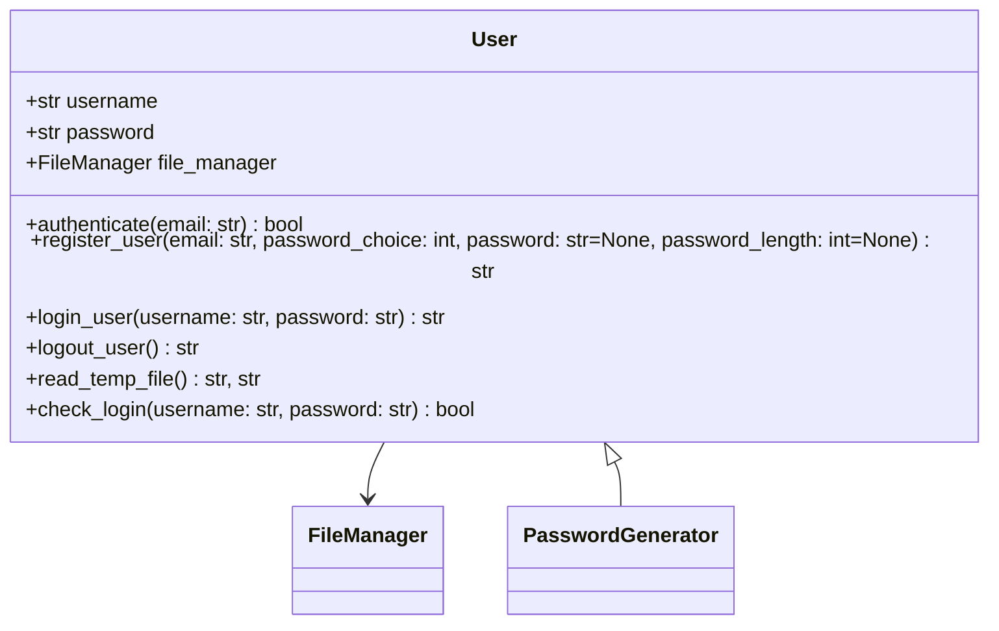

```mermaid
classDiagram
    class User {
        +str username
        +str password
        +FileManager file_manager
        +authenticate(email: str) bool
        +register_user(email: str, password_choice: int, password: str=None, password_length: int=None) str
        +login_user(username: str, password: str) str
        +logout_user() str
        +read_temp_file() str, str
        +check_login(username: str, password: str) bool
    }

    class FileManager
    class PasswordGenerator

    User --> FileManager
    User <|-- PasswordGenerator

```