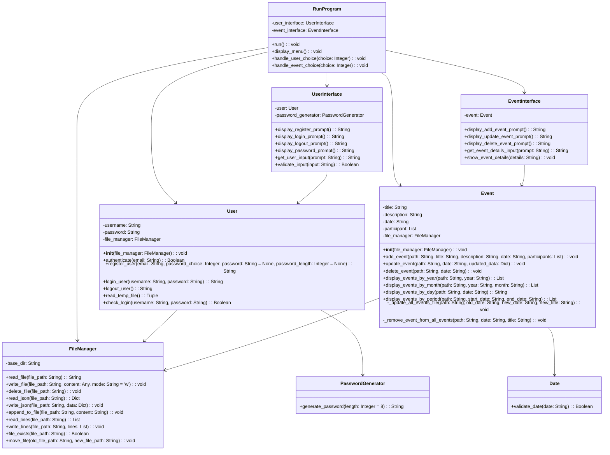

```mermaid
classDiagram
    class PasswordGenerator {
        +generate_password(length: Integer = 8): String
    }

    class FileManager {
        -base_dir: String
        +read_file(file_path: String): String
        +write_file(file_path: String, content: Any, mode: String = 'w'): void
        +delete_file(file_path: String): void
        +read_json(file_path: String): Dict
        +write_json(file_path: String, data: Dict): void
        +append_to_file(file_path: String, content: String): void
        +read_lines(file_path: String): List
        +write_lines(file_path: String, lines: List): void
        +file_exists(file_path: String): Boolean
        +move_file(old_file_path: String, new_file_path: String): void
    }

    class Date {
        +validate_date(date: String): Boolean
    }

    class User {
        -username: String
        -password: String
        -file_manager: FileManager
        +__init__(file_manager: FileManager): void
        +authenticate(email: String): Boolean
        +register_user(email: String, password_choice: Integer, password: String = None, password_length: Integer = None): String
        +login_user(username: String, password: String): String
        +logout_user(): String
        +read_temp_file(): Tuple
        +check_login(username: String, password: String): Boolean
    }

    class Event {
        -title: String
        -description: String
        -date: String
        -participant: List
        -file_manager: FileManager
        +__init__(file_manager: FileManager): void
        +add_event(path: String, title: String, description: String, date: String, participants: List): void
        +update_event(path: String, date: String, updated_data: Dict): void
        +delete_event(path: String, date: String): void
        +display_events_by_year(path: String, year: String): List
        +display_events_by_month(path: String, year: String, month: String): List
        +display_events_by_day(path: String, date: String): String
        +display_events_by_period(path: String, start_date: String, end_date: String): List
        -_update_all_events_file(path: String, old_date: String, new_date: String, new_title: String): void
        -_remove_event_from_all_events(path: String, date: String, title: String): void
    }

    class UserInterface {
        -user: User
        -password_generator: PasswordGenerator
        +display_register_prompt(): String
        +display_login_prompt(): String
        +display_logout_prompt(): String
        +display_password_prompt(): String
        +get_user_input(prompt: String): String
        +validate_input(input: String): Boolean
    }

    class EventInterface {
        -event: Event
        +display_add_event_prompt(): String
        +display_update_event_prompt(): String
        +display_delete_event_prompt(): String
        +get_event_details_input(prompt: String): String
        +show_event_details(details: String): void
    }

    class RunProgram {
        -user_interface: UserInterface
        -event_interface: EventInterface
        +run(): void
        +display_menu(): void
        +handle_user_choice(choice: Integer): void
        +handle_event_choice(choice: Integer): void
    }

    %% Relationships
    RunProgram --> User
    RunProgram --> UserInterface
    RunProgram --> Event
    RunProgram --> EventInterface
    RunProgram --> FileManager
    User --> FileManager
    User --> PasswordGenerator
    UserInterface --> User
    Event --> FileManager
    Event --> Date
    EventInterface --> Event
```