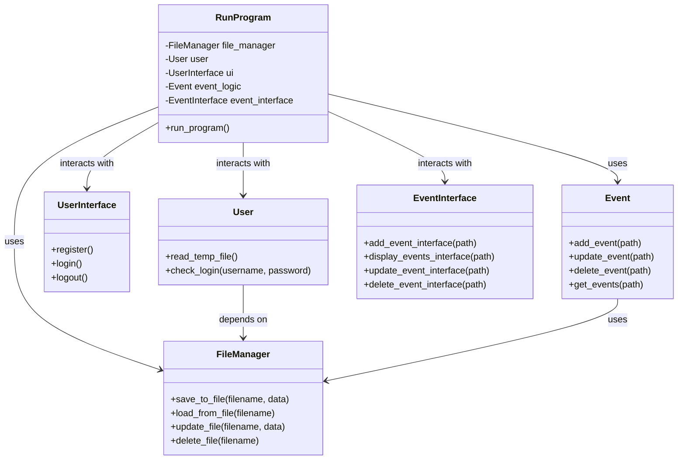

```mermaid
classDiagram
    class RunProgram {
        -FileManager file_manager
        -User user
        -UserInterface ui
        -Event event_logic
        -EventInterface event_interface
        +run_program()
    }

    class User {
        +read_temp_file()
        +check_login(username, password)
    }

    class UserInterface {
        +register()
        +login()
        +logout()
    }

    class Event {
        +add_event(path)
        +update_event(path)
        +delete_event(path)
        +get_events(path)
    }

    class EventInterface {
        +add_event_interface(path)
        +display_events_interface(path)
        +update_event_interface(path)
        +delete_event_interface(path)
    }

    class FileManager {
        +save_to_file(filename, data)
        +load_from_file(filename)
        +update_file(filename, data)
        +delete_file(filename)
    }

    RunProgram --> FileManager : uses
    RunProgram --> User : interacts with
    RunProgram --> UserInterface : interacts with
    RunProgram --> Event : uses
    RunProgram --> EventInterface : interacts with
    User --> FileManager : depends on
    Event --> FileManager : uses


```