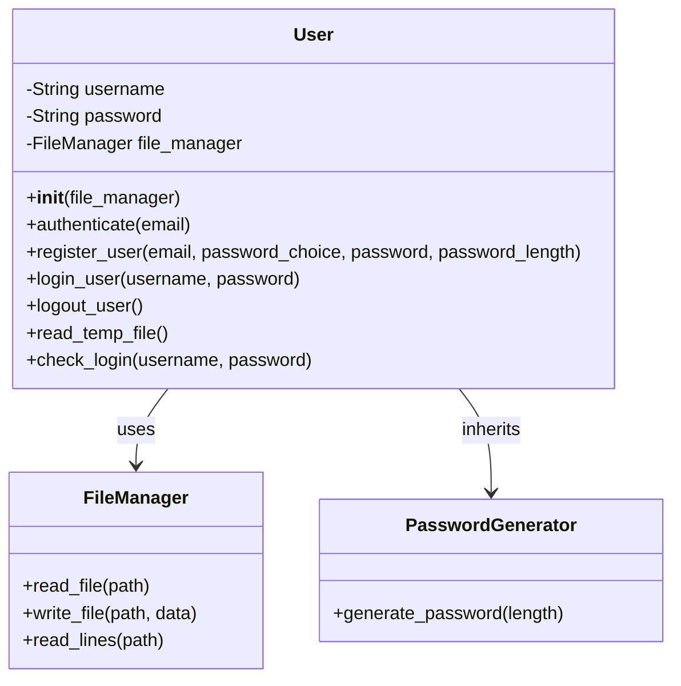

```mermaid
classDiagram
    class User {
        -String username
        -String password
        -FileManager file_manager
        +__init__(file_manager)
        +authenticate(email)
        +register_user(email, password_choice, password, password_length)
        +login_user(username, password)
        +logout_user()
        +read_temp_file()
        +check_login(username, password)
    }

    class FileManager {
        +read_file(path)
        +write_file(path, data)
        +read_lines(path)
    }

    class PasswordGenerator {
        +generate_password(length)
    }

    User --> FileManager : uses
    User --> PasswordGenerator : inherits
```