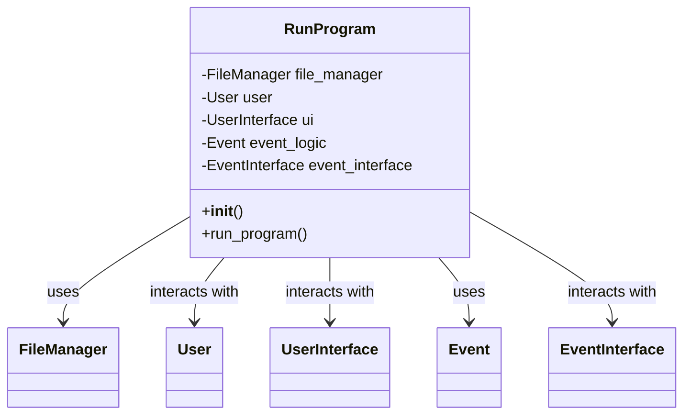

```mermaid
classDiagram
    class RunProgram {
        -FileManager file_manager
        -User user
        -UserInterface ui
        -Event event_logic
        -EventInterface event_interface
        +__init__()
        +run_program()
    }

    class FileManager
    class User
    class UserInterface
    class Event
    class EventInterface

    RunProgram --> FileManager : uses
    RunProgram --> User : interacts with
    RunProgram --> UserInterface : interacts with
    RunProgram --> Event : uses
    RunProgram --> EventInterface : interacts with


```