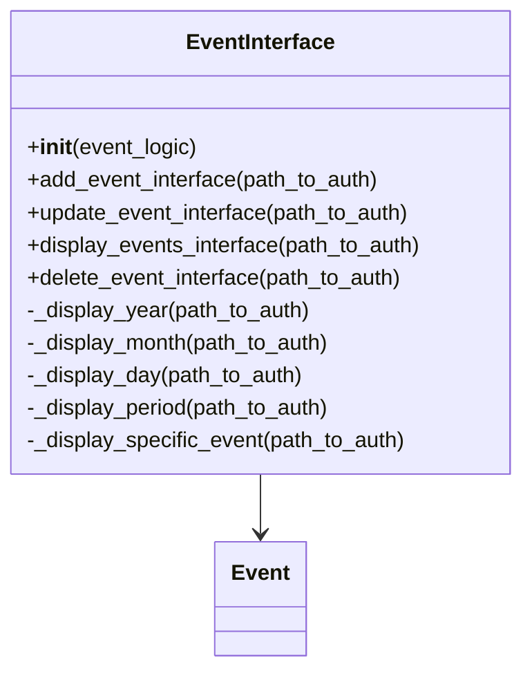

```mermaid
classDiagram
    class EventInterface {
        +__init__(event_logic)
        +add_event_interface(path_to_auth)
        +update_event_interface(path_to_auth)
        +display_events_interface(path_to_auth)
        +delete_event_interface(path_to_auth)
        -_display_year(path_to_auth)
        -_display_month(path_to_auth)
        -_display_day(path_to_auth)
        -_display_period(path_to_auth)
        -_display_specific_event(path_to_auth)
    }

    class Event

    EventInterface --> Event

```